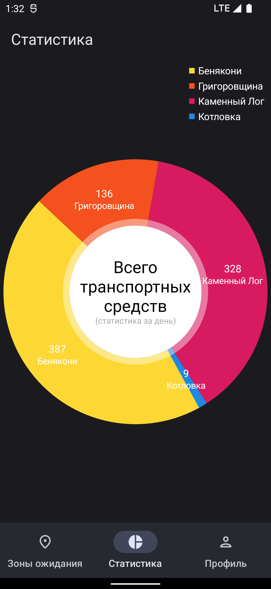

# Clean Android Application

Android application for queue tracking in the «Beltamozhservice» waiting zones.
# Features

* Displaying statistics on the congestion of waiting areas in the form of a graph.
* Search functionality to quickly find information about queue.
* The ability to filter queues by several parameters
* The ability to track your queue with a notification.

# Screenshots
| Mode  | Zone | Zone Details | Bottom Sheet | Statistics | Profile |
|-------|------|-----------|--------------|----------|----------|
| Dark |  |  |  |  |  |
| Light |  |  |  |  |  |

| Foreground Service | 
|------|
|  |

# Video
https://user-images.githubusercontent.com/90863087/232229521-5d0c2e28-8e42-4aa2-af4f-16434a29ac47.mp4

# Architecture Layers

The application has 3 layers: app, data and domain.

## Built With 
- [Kotlin](https://kotlinlang.org/) - First class and official programming language for Android development.
- [Coroutines](https://kotlinlang.org/docs/reference/coroutines-overview.html) - For asynchronous and more..

- [Android Architecture Components](https://developer.android.com/topic/libraries/architecture) - Collection of libraries that help you design robust, testable, and maintainable apps.
  - [LiveData](https://developer.android.com/topic/libraries/architecture/livedata) - Data objects that notify views when the underlying database changes.
  - [ViewModel](https://developer.android.com/topic/libraries/architecture/viewmodel) - Stores UI-related data that isn't destroyed on UI changes.
  - [Navigation Components](https://developer.android.com/guide/navigation/navigation-getting-started) - Navigate fragments easier.
  - [DataBinding](https://developer.android.com/topic/libraries/data-binding) - Allows you to bind UI components in your layouts to data sources in your app using a declarative format rather than programmatically.
  
- [Dependency Injection](https://developer.android.com/training/dependency-injection)
  - [Hilt](https://dagger.dev/hilt) - Easier way to incorporate Dagger DI into Android application.
- [Retrofit](https://square.github.io/retrofit/) - A type-safe HTTP client for Android and Java.
